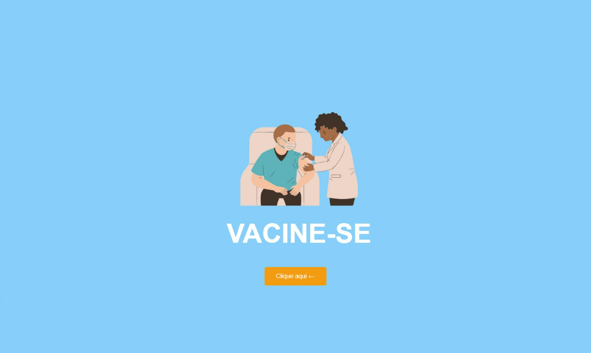
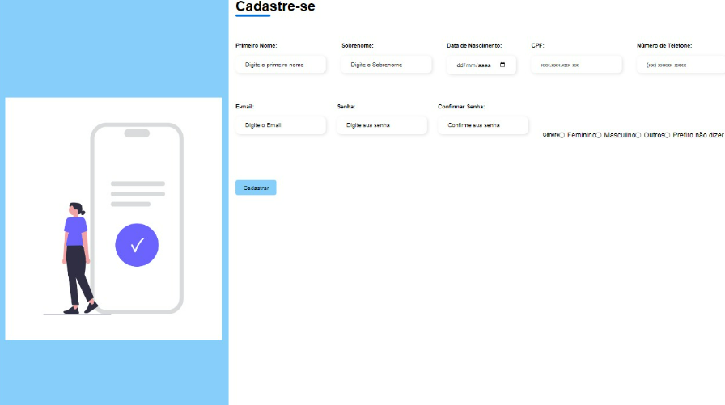
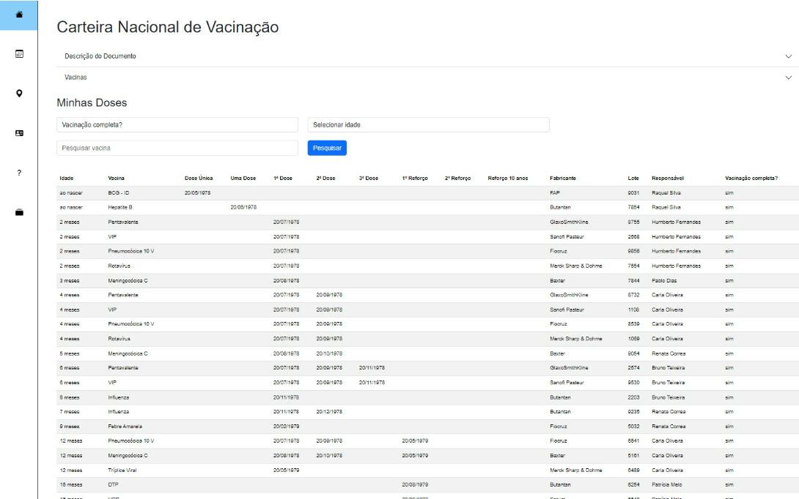
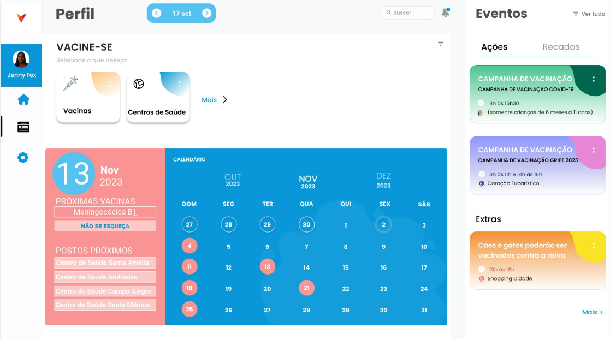
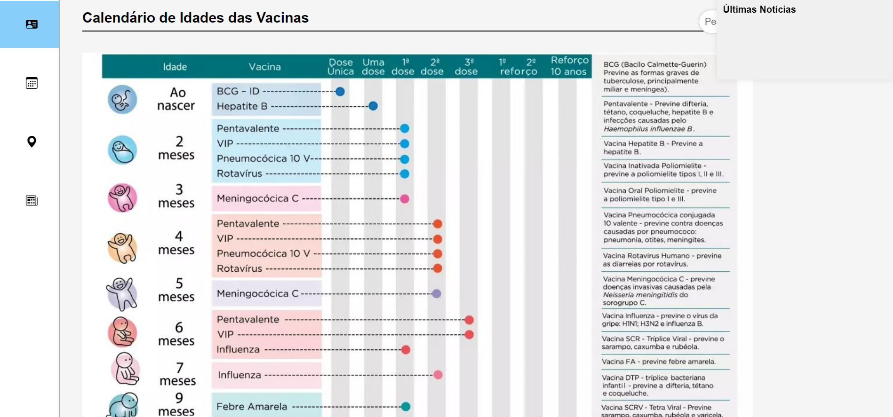
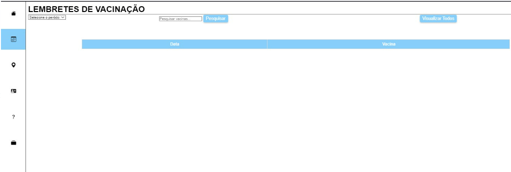

# Projeto de Interface

## User Flow

A imagem a seguir ilustra o fluxograma que é uma representação esquemática do site.

# Wireframes
Abaixo o protótipo representando o design de interface.

## Tela Inicial

## Tela de Login

## Tela de Cadastro

## Tela Cartão Nacional de Vacina

## Tela Calendário Vacina

## Tela Mapa

## Tela Calendário de Idades da Vacina

## Tela Lembretes de Vacinação

## Protótipo Funcional

https://www.figma.com/proto/4vZZWtUEvidUXMqIyMV8F1/Dashboard-Student-Activities-(Community)?type=design&node-id=313-10&t=AZBVirHhOmvtKzBn-1&scaling=min-zoom&page-id=0%3A1&starting-point-node-id=313%3A10&mode=design
