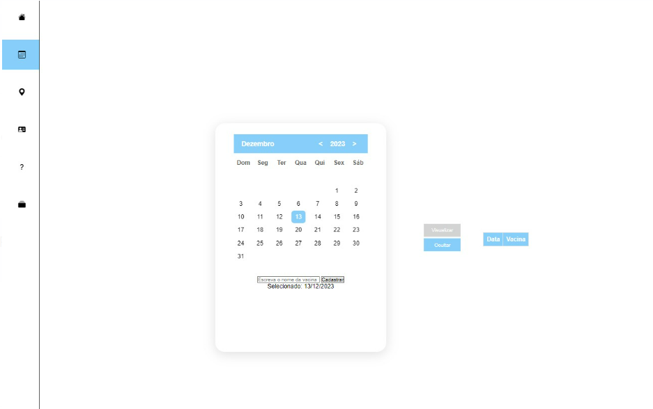
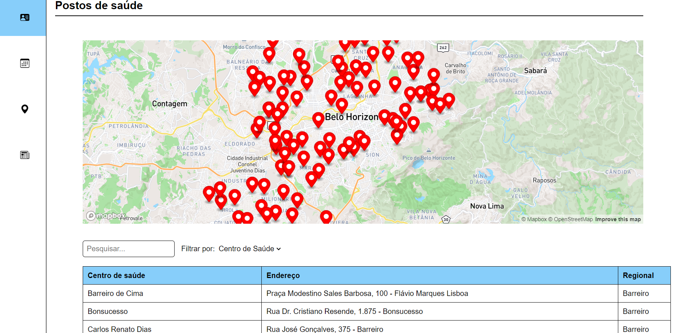

# Projeto de Interface

# Wireframes
Abaixo o protótipo representando o design de interface.

## Tela Inicial

## Tela de Login

## Tela de Cadastro

## Tela Cartão Nacional de Vacina

## Tela Calendário Vacina

## Tela Mapa

## Tela Calendário de Idades da Vacina

## Tela Lembretes de Vacinação

## Protótipo Funcional

[https://www.figma.com/proto/4vZZWtUEvidUXMqIyMV8F1/Dashboard-Student-Activities-(Community)?type=design&node-id=399-56&t=rNjzE62sb8CsPtMf-1&scaling=min-zoom&page-id=0%3A1&starting-point-node-id=313%3A21&mode=design
