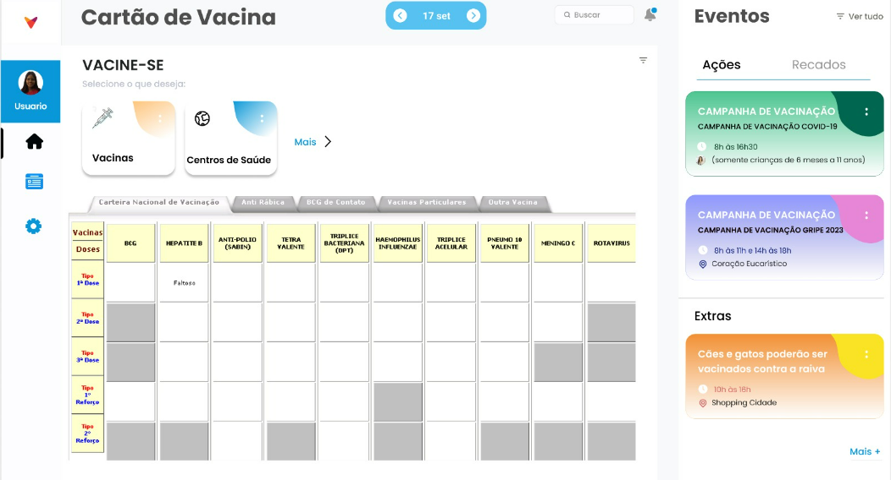
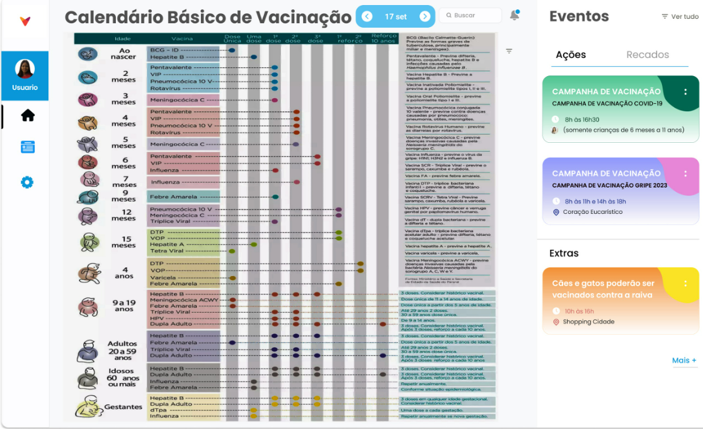

# Projeto de Interface

## User Flow

A imagem a seguir ilustra o fluxograma que é uma representação esquemática do site.

# Wireframes
Abaixo o protótipo representando o design de interface.

## Tela Inicial

## Tela Cartão Vacina

## Tela Calendário Vacina

## Tela Mapa

## Tela Tabela das Idades

## Tela dúvidas

