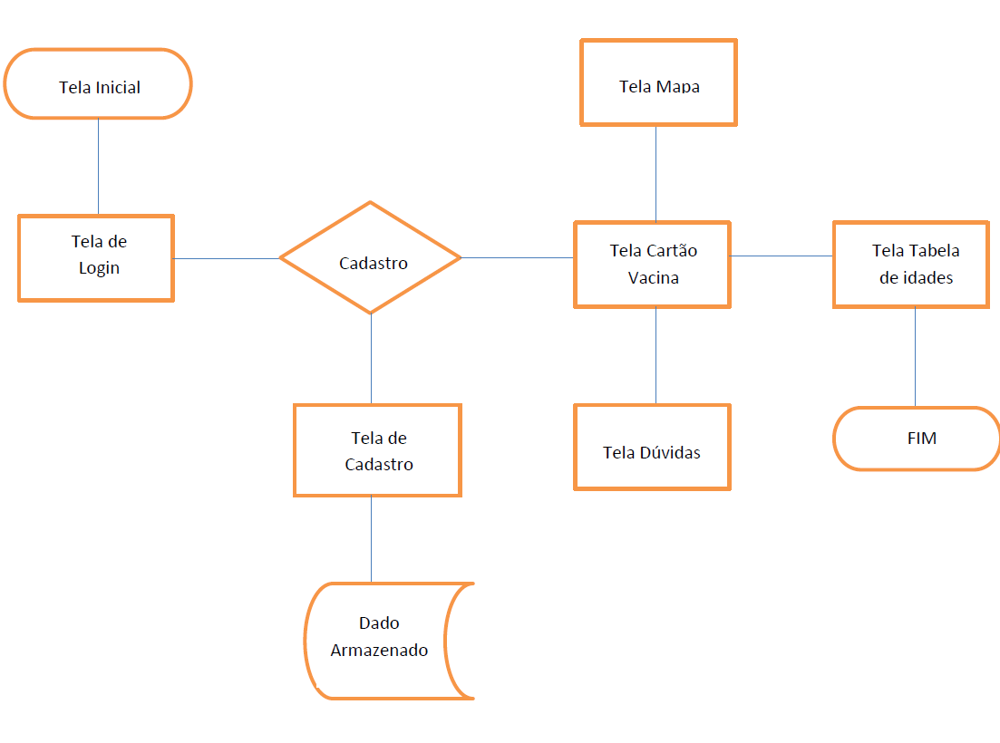
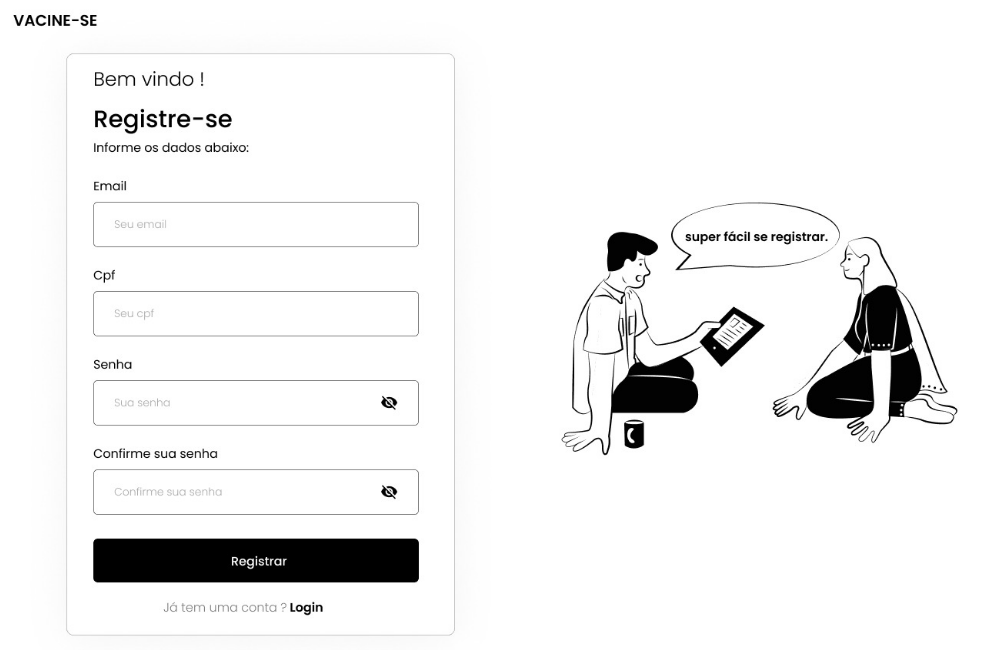
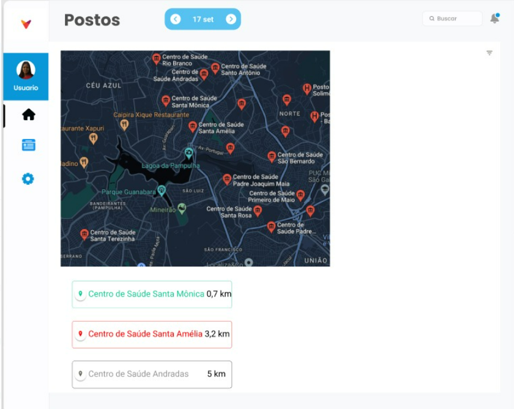
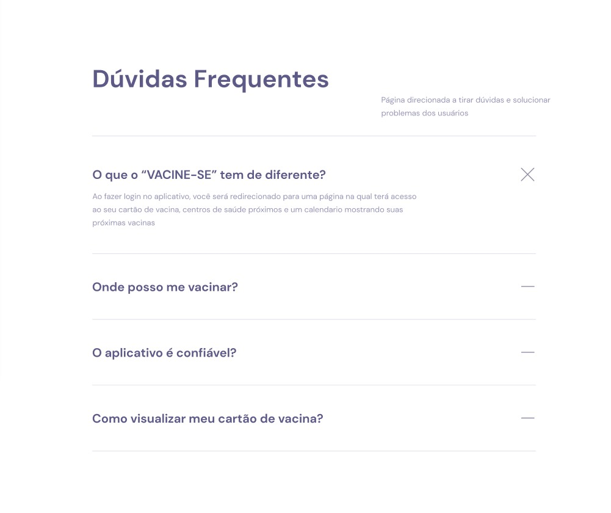

# Projeto de Interface

## User Flow

A imagem a seguir ilustra o fluxograma que é uma representação esquemática do site.

# Wireframes

![UserFlow](images/Fluxograma.png

## Tela Inicial

![UserFlow](images/Fluxograma.png

## Tela de Login

![UserFlow](images/Fluxograma.png

## Tela de Cadastro

## Tela Cartão Vacina

![UserFlow](images/Fluxograma.png

## Tela Mapa

## Tela dúvidas

## Tela Tabela das Idades
