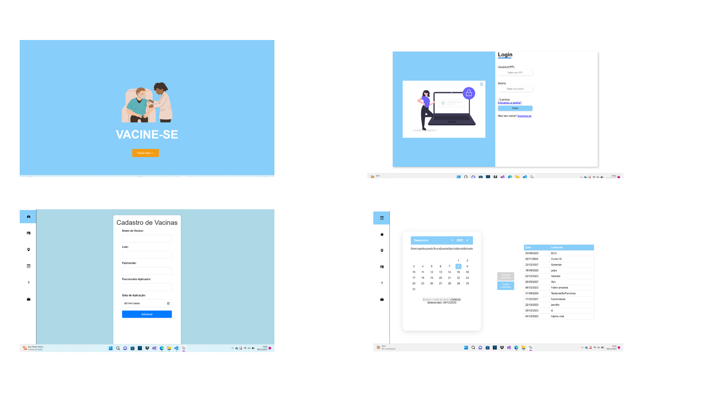
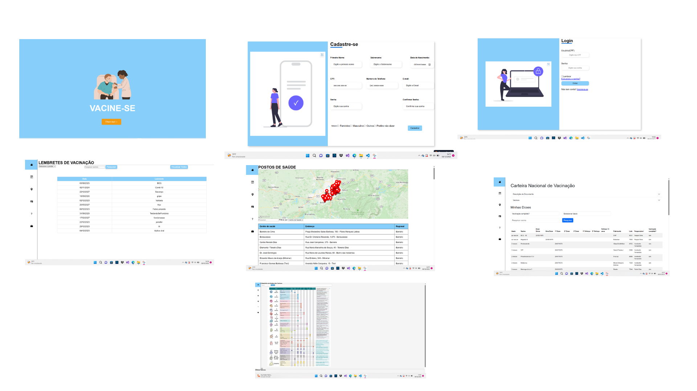

# Projeto da solução

## Tecnologias utilizadas
| TIPO | NOME |
|------|------|
| Linguagem de marcação | HTML |
| Linguagem de estilo | CSS |
| Linguagem de programação | JavaScript |
| Framework | Bootstrap |
| IDE | Replit |
| Controle de versão compartilhado | GitHub |
| Hospedagem | Replit |

## Arquitetura da solução

### Tela do Funcionário

Assim que o funcionário entra na plataform, ele tem acesso as telas de:
- Login: Acessa com as credencias de acesso especificas do funcionário.
- Cadastro de Vacinas: Usado para cadastrar a vacina que o usuário irá tomar.
- Cadastro de Próximas Vacinas: Usado para cadastrar as próximas doses que o usuário deve tomar.

### Tela do Usuário

Assim que o usuário entra na plataforma ele tem acesso as telas de:
- Cadastro de Usuários: Usado para se cadastrar, caso não tenha um login.
- Login: Acessa com as credenciais cadastradas.
- Cartão de Vacina: Acesso ao cartão de vacina com todas as vacinas que foram tomadas.
- Calendário: Acessa os lembretes das próximas vacinas que se deve tomar.
- Mapa: Acessa todos os postos de saúde de Belo Horizonte, para que se possa ver qual o mais próximo da localidade.
- Tabela Idades: Acessa com que idade se deve tomar as vacinas e acessa o portal com informações sobre campanhas.
